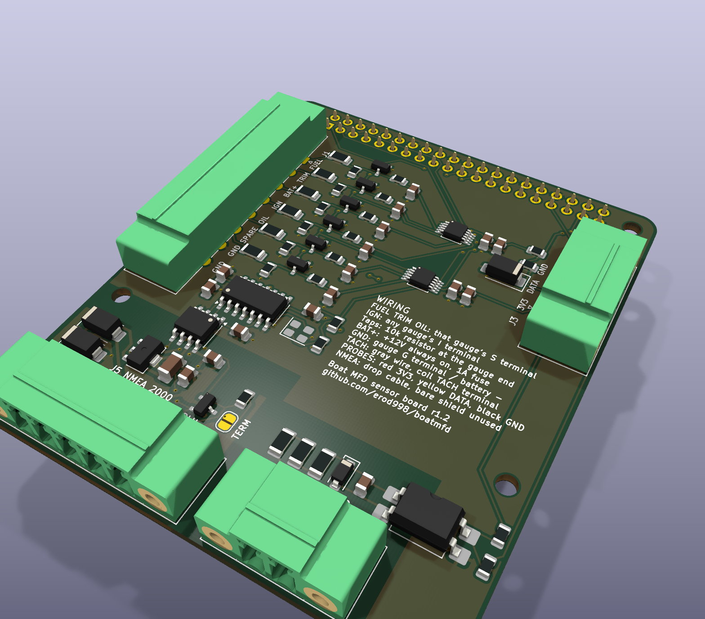

# Sensor board: passive taps on the existing gauges

A Raspberry Pi HAT that reads **fuel level, trim, oil pressure, engine temperature, battery
voltage and RPM** by
*listening* to the wires the boat's analog gauges already use -- and, since rev 1.1, puts the Pi on
the boat's **NMEA 2000** network (the Fusion stereo, the depth transducer) through an isolated
CAN interface, so no separate CAN HAT is needed. Since rev 1.2 it also powers the Pi, from an
external 12 V to 5 V converter wired to J7, and has a connector (J6, LIGHTS) for a separate LED
controller board -- since rev 1.3 an RJ45, for an ordinary patch cable to the
[LED board](LED_BOARD.md). Nothing is disconnected: every
analog gauge stays wired exactly as it is and keeps working, so if the Pi is off or broken the
helm is just a normal helm. It replaces buying an engine-data converter (the CX5003 route).

Built for this boat: a MerCruiser 3.0 4-cylinder with the **Delco EST ignition** (the newer
coil with two terminals, BAT +12 V in and TACH out), US-standard resistive senders, and the
stock analog gauges.

- **Design files:** [hardware/sensor-board/](hardware/sensor-board/) -- a KiCad 10 project
  (schematic, board, project footprint library) generated from one Python description.
- **Ready to order:** [hardware/sensor-board/fab/](hardware/sensor-board/fab/) -- Gerbers and
  drill files, BOM, pick-and-place, schematic and assembly PDFs, renders.
- **Software:** `BOAT_SENSORS=real` with `BOAT_SENDER_WIRING=tap`
  ([app/sender_tap.py](app/sender_tap.py) has the maths and why it works;
  [tests/test_sensor_board.py](tests/test_sensor_board.py) runs it end to end against simulated
  gauges).

> **Status: a checked design, not a proven board.** Rev 1.3 (the RJ45 link to the LED board, and
> the house battery input on J1.8) passes KiCad's electrical rules check, its design rules check
> and its schematic-to-board parity check with nothing reported at any severity, and `fab/` is
> built from it. No board has been built or connected to this boat yet, so the bring-up section
> below checks each block with a multimeter before it is trusted.



---

## How it works

```
               BACK OF THE GAUGES (unchanged)                           SENSOR BOARD (Pi HAT)
  fuel gauge   S ── to the fuel sender ─────────── tap wire ── J1.1 FUEL ────┐
  trim gauge   S ── to the trim sender ─────────── tap wire ── J1.2 TRIM ────┤ divider, clamp, filter
  any gauge    I ── key-on +12 V ───────────────── tap wire ── J1.4 IGN ─────┤   ADS1115 U1 (0x48)
               G ── ground ────────────────────────────────── J1.7 GND      │     AIN0 fuel   AIN1 trim
  oil gauge    S ── to the oil sender ──────────── tap wire ── J1.5 OIL ─────┤     AIN2 batt   AIN3 gauge supply
  temp gauge   S ── to the temp sender ─────────── tap wire ── J1.6 TEMP ────┤   ADS1115 U2 (0x49)
  engine battery + (fused 1 A at the battery) ─────────────── J1.3 ENG+ ────┤     AIN0 oil    AIN1 temp
  house battery + (fused 1 A at the battery) ──────────────── J1.8 HSE+ ────┘     AIN2 house

  gray wire: EST coil TACH terminal ── tach gauge ─────────── J2.1 TACH ──── optocoupler ──── GPIO 13
  the tach gauge's G terminal ─────────────────────────────── J2.2 GND (the tach's own, isolated)

  NMEA 2000 drop cable (Fusion stereo, depth transducer) ───── J5 ── isolated CAN ── SPI0 + GPIO 25 (can0)

  LED board (LED_BOARD.md), patch cable ───────────────────── J6 (RJ45) ── differential I2C ── GPIO 5 / 6

  12 V -> 5 V converter (separate) ── J7 ── ideal diode ── header pins 2, 4: the Pi, and from it this board's 3V3
```

- **Taps** read the voltage on each gauge's **S** (sender) terminal, and once on the gauges' shared
  **I** (ignition supply) terminal. Each level is worked out from the sender voltage *as a share of
  the gauge supply*, so it doesn't shift when the alternator starts charging. With the key off the
  gauges are dark, and so are these readings ("--").
- The voltage on the S terminal is **not linear** in fuel level: the gauge and the sender form a
  divider. The software models that divider exactly (see app/sender_tap.py), so two calibration
  points anywhere on the scale -- "just filled up", and one mark read off the analog gauge later --
  calibrate the whole range, near-empty included. A straight line would be ~20 points out at half
  a tank.
- **Every tap resistor is on the board** (49.9 kΩ on top, 10 kΩ below, which the software
  assumes: `BOAT_TAP_R_TOP=49900`), so a tap wire is plain wire from the gauge terminal to J1.
  That makes each tap wire part of its gauge's circuit: one chafed through to ground would read
  on that gauge like a shorted sender (and on IGN, short the key-on 12 V). Route them so they
  can't chafe, and secure them. (Rev 1.0-1.1 put 10 kΩ of the top resistor at the gauge end of
  each wire instead, which made a chafed wire harmless.)
- The **tach** input goes through an **optocoupler**, so nothing on the ignition side can reach
  the Pi. It has to: the EST coil's **TACH** terminal is the coil's switched side. It sits at
  12 V, drops to ground while the coil charges, and flies up to a few hundred volts at every
  spark. That's what the analog tach counts, and the board reads the same wire.
- A tap loads the gauge by about 0.2 mA (59 kΩ from the S terminal to ground). Next to a 33–240 Ω
  sender that is well under half a percent -- the analog gauges read the same as before.

---

## Schematic, block by block

Reference designators match the KiCad schematic
([PDF](hardware/sensor-board/fab/sensor-board-schematic.pdf)). `3V3` and `GND` are the Pi's.

### Tap inputs (×7: fuel, trim, engine battery, gauge supply, oil, engine temperature, house battery)

```
                                             on the board
  gauge terminal ── tap wire ── J1.x ──[ R1 49.9k 1% 1206 ]──┬──[ R13 1k ]──┬── ADS1115 AINx
                                                             │              │
                                                    [ R7 10k 1% ]      [ C1 100n ]
                                                             │              │
                                                            GND            GND
                                     D1 BAT54S: clamps the node (R1/R7) between GND and 3V3
```

- **R1/R7** divide 0–16 V down to 0–2.7 V (`V_adc = V_tap × 10/59.9`).
- **D1 (BAT54S)** clamps the divider node between GND and 3V3 so a transient can never push the
  ADC input past its limits; the 49.9 kΩ in front of it keeps the clamp current to about 2 mA even
  at 100 V.
- **R13/C1** are a noise filter right at the ADC pin (and keep the clamp's forward voltage away from it).
- No TVS diode on these inputs: the 49.9 kΩ already limits any transient to a couple of
  milliamps, and a TVS's leakage current, flowing through it, would show up as a reading error.
- The top resistors are 1206 for their voltage rating; everything else is 0805.
- Channels, top to bottom on the board: fuel (R1, R7, R13, C1, D1), trim (…2), engine battery
  (…3), gauge supply (…4), oil (…5), engine temperature (…6). The house battery's (R35, R36, R37,
  C24, D13) came in rev 1.3, after the other parts were numbered; with no room left in that
  column, its lane runs right to left beside U2.

### Battery voltages (J1.3 engine, U1 AIN2; J1.8 house, U2 AIN2)

The boat has two batteries on a common negative, their positives kept apart: the engine's and
the house's (lights and stereo). Each input is the same as a tap input, except the top resistor
is **47 kΩ 1% 1206** (R3 engine, R35 house), giving `V_adc = V_batt × 10/57`. The software
default `BOAT_BATT_R_TOP=47000`, `BOAT_BATT_R_BOTTOM=10000` matches both. Wire each straight from
its battery's + terminal through a **1 A fuse at the battery**, not from a switched feed, so both
read with every switch off; the divider draws about 0.2 mA, some 2 Ah a year. One GND (J1.7)
serves both, since they share the negative. (J1.8 was a second GND until rev 1.3.)

### Tach: the EST coil's TACH terminal, gray wire (optocoupler)

```
  gray wire (TACH) ───── J2.1 ──[ R19 3.3k ]──[ R20 3.3k ]──[ R21 3.3k ]──┬─────────┬─────────┬── U3 pin 1 (LED anode)
                                   1206          1206          1206        │         │         │
                                                                     [ C11 10n ] [ D7 ]        │  D7: 1N4148W, cathode
                                                                           │     1N4148W       │  toward pin 1
  tach gauge G ───────── J2.2 ─────────────────────────────────────────────┴─────────┴─────────┴── U3 pin 2 (LED cathode)
                          (printed GND, but its own net, TACH_GND -- not the board's GND)

                                              3V3
                                               │
                                          [ R22 10k ]
                                               │
  U3 pin 4 (collector) ────────────────────────┴───[ R23 1k ]─── GPIO 13 (header pin 33)
  U3 pin 3 (emitter) ── GND
```

- Three 1206 resistors in series share an ignition spike (≈130 V each at a 400 V spike, inside a
  1206's rating) and set about 1 mA through the LED at 12 V -- plenty for a PC817 rank B/C.
- **C11** filters the ring-down after each spark; **D7** stops the ring-down's negative swing from
  reverse-biasing the LED.
- **R23** protects the GPIO if it is ever set as an output by mistake.
- The Pi sees one clean rising edge per ignition cycle, which is what the tach code counts: two per
  revolution on the 4-cylinder (`BOAT_TACH_PPR=2`, the default). Set **`BOAT_TACH_PULL=none`**:
  R22 is the pull-up.
- The board draws about 1 mA from the gray wire, next to the analog tach, which stays connected.

### NMEA 2000: isolated CAN interface

```
                    THE NETWORK'S SIDE (its own 0 V: N2K_GND)          │  THE PI'S SIDE
  J5.2 NET-S ──[ D9 SS14 ]──┬── N2K_12V ──[ U6 L78L05 ]── N2K_5V ──┐   │
                            ├─[ D10 SMAJ18A ]─ N2K_GND             │   │
                            └─[ C16 1µ 50V ]── N2K_GND   C17, C18 ─┤   │
  J5.3 NET-C ── N2K_GND                                            │   │
  J5.4 NET-H ──┬── D11 NUP2105L ── N2K_GND              U5 ISO1044 ┴ VCC2 │ VCC1 ── 3V3
  J5.5 NET-L ──┤   R26 120 + JP1 (open)                    CANH/CANL  │  TXD/RXD ── U4 MCP2518FD ── SPI0: GPIO 8-11
  J5.1 shield: not connected                                          │             INT ────── GPIO 25
                                                                      │             OSC1 ───── Y1 40 MHz
```

- **U4 (MCP2518FD)** is a CAN FD controller on the Pi's SPI0, the same chip family as the
  MacArthur HAT and most current CAN HATs; Raspberry Pi OS's own `mcp251xfd` driver makes it
  `can0`. R27 keeps it deselected while the Pi boots, R28 pulls its interrupt line up.
- **U5 (ISO1044)** is an isolated CAN transceiver: its Pi side runs from 3V3 and the Pi's ground,
  its network side from the NMEA 2000 network's own NET-S and NET-C. The two never share a ground,
  so the stereo's power wiring and the Pi's can't form a ground loop through the CAN wires, which
  is what the NMEA 2000 standard expects of a device with its own power supply.
- **D9** stops a reversed NET-S from doing anything; **D10** clamps surges on it; **U6** makes 5 V
  for U5's network side. The board draws well under 50 mA from the network: **1 LEN**.
- **D11** protects NET-H and NET-L from ESD and surges.
- **JP1 is open, and stays open on the boat.** Bridging it puts R26 (120 Ω) across NET-H/NET-L,
  for a bench test with just the Pi and the stereo and no backbone. A device on a real network
  must not terminate it -- the backbone's two terminators do that.
- The network side is its own island on the board: every N2K net is at least **2 mm** from all
  other copper (a rule KiCad's DRC checks, in `sensor-board.kicad_dru`), with its own ground pour,
  kept 4 mm clear of the Pi mounting hole beside it so a metal standoff can't bridge the two.

### No temperature probes

Every temperature comes from the boat's own senders: the engine's through its temperature gauge
(J1 TEMP, above), the water's from the depth transducer on NMEA 2000, if it reports one. Rev 1.0
and 1.1 had a 1-Wire input (J3) for DS18B20 probes clamped to the engine; rev 1.2 has none.

### Converters and header

```
  ADS1115 U1                              ADS1115 U2
    VDD ── 3V3, C7 100n + C8 1µ to GND      VDD ── 3V3, C9 100n + C10 1µ to GND
    SCL ── GPIO 3 (pin 5)                   SCL ── GPIO 3 (pin 5)
    SDA ── GPIO 2 (pin 3)                   SDA ── GPIO 2 (pin 3)
    ADDR ── GND   -> address 0x48           ADDR ── 3V3   -> address 0x49
    AIN0 fuel  AIN1 trim                    AIN0 oil  AIN1 temp  AIN2-3 not connected
    AIN2 battery  AIN3 gauge supply
    ALERT/RDY: not connected                ALERT/RDY: not connected
```

No I²C pull-ups on the board: the Pi already has them on GPIO 2/3, and a second board stacked on
the header would double them up.

### 5 V in (J7): the Pi's power

```
  J7.1 +5V ──┬──────────── Q1 IRLML0030 (S -> D) ──────────────┬──── header pins 2, 4 (the Pi's 5 V)
             │                     │ G                         ├── C21 22µ
         [ C20 100n ]         U7 LM74700 ideal diode:           └── D12 SMAJ5.0A (to GND)
             │                ANODE/EN to J7.1, CATHODE to the Pi side,
  J7.2 GND ──┴── GND          GATE to Q1, VCAP: C19 100n to ANODE
```

- The converter's output (set it to **5.1-5.2 V**, rated 3 A or more) runs the Pi through the
  header's 5 V pins, as the Raspberry Pi HAT guide allows (5 V ±5 %, up to 2.5 A). This board's
  3V3 comes from the Pi, as before; the NMEA 2000 side still runs from the network's own 12 V.
- **U7 + Q1 are an ideal diode**: about 20 mV forward drop, where a Schottky would lose 0.4 V the
  Pi can't spare (it warns of undervoltage below 4.63 V). **J7 wired backwards** is blocked --
  nothing conducts, and U7 is rated to -65 V. With the Pi's **USB-C plugged in as well**, that
  supply can't push current back into the converter. (The Pi 4 has no diode of its own on
  USB-C, though, so the converter would feed the USB supply: don't plug both in on the boat.)
- **D12** clamps spikes on the rail. None of this saves the Pi from a converter that fails with
  12 V on its output, so pick one with output overvoltage protection.
- J7 and these parts sit on a **tab above the header's left half** (see Ordering): the Pi's 5 V
  pins are at that corner, and the tab keeps the 5 V run to them short.

**On the boat: the Pi 5 and its SSD run from the Pi's own USB-C, not J7.** A Pi 5 with an NVMe
SSD (the M.2 board under this one, see below) can draw more than the 2.5 A J7 and the header are
built for. So the boat's Pi 5 takes its power the usual way, through its USB-C, from a 12 V -> 5 V
converter good for **5 A**, and the Pi feeds the SSD board and this board through the header, as
Raspberry Pi's own M.2 HAT+ is fed. **J7 stays unconnected** (still fitted, for a Pi on its own).
The ideal diode keeps the Pi's 5 V from reaching J7's terminals. J7 remains the way to power a
Pi 4, or a Pi 5 without an SSD.

**Stacked on an M.2 SSD board.** The boat's Pi 5 boots from an NVMe SSD on a PCIe-to-M.2 board
(Waveshare PCIe TO M.2 HAT+, 2230/2242 drives). That board sits on the Pi, over its Active Cooler,
with a stacking header passing the 40 pins up, and this board plugs onto that header. Nothing
clashes. The only part on this board's underside is its header socket, apart from the
connectors' solder joints: check those clear the SSD. The M.2 board's own ID EEPROM is the only one, since this
board has none. Its INA219 power monitor sits at I²C address 0x40, while this board's ADCs are at
0x48 and 0x49. Use standoffs tall enough for the two levels.

### Lights connector (J6): the link to the LED board

The LED controllers are deliberately **not** on this board: 20 A of switched strip current would
sit next to the millivolt-level gauge taps, and a shorted strip shouldn't be able to take the
engine data down with it. They're on the [LED board](LED_BOARD.md), and J6 is its link: an
**RJ45** for an ordinary straight-through Cat5e/Cat6 patch cable (rev 1.3; rev 1.2 had an 8-way
JST GH carrying logic-level signals, which a long cable run through a boat would not have liked).

```
  J6.1 / J6.2  ── pair: the LED board's I2C clock  ┐ differential I2C (U8, a PCA9615): GPIO 5/6,
  J6.3 / J6.6  ── pair: the LED board's I2C data   ┘ the LED board's own bus (R24/R25 pull it up)
  J6.4 / J6.5, J6.7 / J6.8 ── the other two pairs: reserved, not connected
```

- **One I2C bus, everything on it.** The LED board's PCA9685 (0x40, its four RGBW zones), its
  current monitor (INA226, 0x45) and the RP2040 that runs its four addressable outputs (0x30) all
  sit on the bus from GPIO 5/6. It's a bus of its own, so a fault out there can't stall the
  converters' bus and with it the engine data; and a kernel-driven one (i2c-gpio), which honours
  clock stretching -- the RP2040 stretches, and the Pi's hardware I2C gets that wrong.
- **Differential I2C**: U8 (NXP PCA9615) turns the bus into two differential pairs at 5 V, and the
  LED board's PCA9615 turns it back. Each pair is terminated at both ends, 620 Ω up, 120 Ω across,
  620 Ω down (R29-R34 here), so the cable is matched and an idle bus reads as idle. Good for many
  metres of cable at the 100 kHz the bus runs at.
- **No ground and no power in the cable.** The strips' current returns on the LED board's own
  heavy ground wire to the supply's ground point, and can't come back through the Pi. The PCA9615
  is built for exactly this: it tolerates a few volts between the two boards' grounds.
- **NOT Ethernet.** Never plug either end into a network switch, router or PoE injector: the
  pairs carry 5 V logic, and a PoE injector would put 48 V on them. Both boards say so beside
  their RJ45s.
- **GPIO 18, 19 and 21 are free since rev 1.3**: rev 1.2 passed them to the LED board for
  addressable data, but the Pi can only drive two such strips (and none on a Pi 5), so the LED
  board's RP2040 makes that data itself now.

Software: `dtoverlay=i2c-gpio,bus=7,i2c_gpio_sda=5,i2c_gpio_scl=6` in `/boot/firmware/config.txt`,
then `BOAT_LED_DRIVER=ledboard` and `BOAT_LED_I2C_BUS=7` (LED_BOARD.md, "Software").

---

## Pi header pins used

| Pin | Signal | Use |
|---|---|---|
| 2, 4 | 5V | **in**: the Pi's power, from J7 through the ideal diode |
| 1, 17 | 3V3 | converters, pull-ups, U8's input side (a few mA in total) |
| 3 | GPIO 2 / SDA | both ADS1115 |
| 5 | GPIO 3 / SCL | both ADS1115 |
| 6, 9, 14, 20, 25, 30, 34, 39 | GND | |
| 33 | GPIO 13 | tach |
| 19, 21, 23, 24 | GPIO 10, 9, 11, 8 (SPI0 MOSI, MISO, SCLK, CE0) | NMEA 2000 CAN controller |
| 22 | GPIO 25 | CAN controller interrupt |
| 29, 31 | GPIO 5, 6 | SDA, SCL of the LED board's own I2C bus (i2c-gpio), out on J6 through U8 |

Everything else is left free -- GPIO 18, 19 and 21 too, since rev 1.3 -- GPIO 4 (used for NMEA 0183 by some marine HATs) included. The
header is a stacking socket, so another HAT can go on top; check its pin list against this one
first -- in particular, a CAN HAT on SPI0 CE0 would clash with the one built in here.

## Connectors

J1, J2, J5 and J7 are Phoenix Contact **MC 1,5 / 3.81 mm pluggable terminal blocks with
screw-locking flanges**: the plug screws to the header, so it can't walk out on a boat. Each
connector's plug overhangs the board edge. J6, the LED board's link, is an **RJ45** for a
straight-through patch cable (Amphenol 54602-908LF, on the tab beside J7's, facing up).

Since rev 1.2 every pin is labelled on the board itself, beside the pin, with the name in the
**Printed** column; the **WIRING** block in the middle of the board sums up the table below.

| Connector | Pin | Printed | Goes to |
|---|---|---|---|
| **J1** helm (8, left edge) | 1 | FUEL | fuel gauge **S** terminal |
| | 2 | TRIM | trim gauge **S** terminal |
| | 3 | ENG+ | the engine battery's **+** terminal, through a **1 A fuse at the battery** |
| | 4 | IGN | the **I** terminal on the back of any one gauge. That's the key-switched +12 V that lights the gauges; they all share it, so any gauge will do. The board measures the senders as a share of it, and uses it to tell that the key is on |
| | 5 | OIL | oil gauge **S** terminal |
| | 6 | TEMP | engine temperature gauge **S** terminal |
| | 7 | GND | the **G** terminal of the same gauge as IGN: the taps measure against the gauges' own ground |
| | 8 | HSE+ | the house battery's **+** terminal, through a **1 A fuse at the battery** (rev 1.3; was a second GND) |
| **J2** tach (2, bottom edge) | 1 | TACH | the **gray wire** from the EST coil's **TACH** terminal -- easiest where it lands on the tach gauge's signal terminal at the helm. No resistor on this one |
| | 2 | GND | the tach gauge's **G** terminal -- twist these two wires together |
| **J5** NMEA 2000 (5, bottom edge) | 1 | BARE | the drop cable's bare drain wire (shield) -- **not connected** here (the backbone grounds its shield at the power tee) |
| | 2 | RED | NET-S: the network's +12 V |
| | 3 | BLK | NET-C: the network's 0 V |
| | 4 | WHT | NET-H: CAN high |
| | 5 | BLU | NET-L: CAN low |
| **J6** lights (RJ45, on the tab, facing up) | 1-8 | "J6 LIGHTS: LED board J1 / patch cable, NOT ETHERNET" | the LED board's J1, by a straight-through Cat5e/Cat6 patch cable (see "Lights connector" above) |
| **J7** 5V IN (2, on the tab, plug faces up) | 1 | +5V | the 12 V -> 5 V converter's **+5 V** output |
| | 2 | GND | the converter's **0 V** output |
| **J4** | | | the Pi's 40-pin header, underneath |

---

## Parts list

The full list, with manufacturer part numbers, is
[fab/sensor-board-bom.csv](hardware/sensor-board/fab/sensor-board-bom.csv). In short:

| Ref | Qty | Part | Notes |
|---|---|---|---|
| U1, U2 | 2 | **ADS1115IDGSR** (TI, TSSOP-10) | 0x48 and 0x49 |
| U3 | 1 | **PC817**, rank B or C, SMD gull-wing | tach optocoupler |
| R1, R2, R4–R6 | 5 | 49.9 kΩ 1% **1206** | tap top resistors |
| R3, R35 | 2 | 47 kΩ 1% **1206** | engine and house battery top resistors |
| R7–R12, R36, R22 | 8 | 10 kΩ 1% 0805 | divider bottoms; tach pull-up |
| R13–R18, R37, R23 | 8 | 1 kΩ 0805 | ADC pin series resistors; GPIO protection |
| R19–R21 | 3 | 3.3 kΩ **1206** | tach input, in series |
| R24, R25 | 2 | 4.7 kΩ 0805 | the LED board bus's pull-ups |
| U8 | 1 | **PCA9615DP** (NXP, TSSOP-10) | differential I2C for the LED link |
| R29-R34, C22, C23 | 6 + 2 | 620 / 120 / 620 Ω ×2, 100 nF, all 0402 | the link's pair terminations; U8's decoupling |
| C1–C7, C9, C24 | 9 | 100 nF X7R 0805 | ADC pin filters; decoupling |
| C8, C10 | 2 | 1 µF X7R 0805 | decoupling |
| C11 | 1 | 10 nF X7R 0805 | tach ring-down filter |
| D1–D6, D13 | 7 | BAT54S (SOT-23) | clamps |
| D7 | 1 | 1N4148W (SOD-123) | across the opto LED |
| U4 | 1 | **MCP2518FD** (Microchip, SOIC-14) | CAN controller |
| U5 | 1 | **ISO1044BD** (TI, SOIC-8) | isolated CAN transceiver |
| U6 | 1 | L78L05 (SOT-89) | 5 V for the network side |
| Y1 | 1 | 40 MHz 3.3 V oscillator, 3.2 × 2.5 mm | CAN controller clock |
| D9 / D10 / D11 | 1 each | SS14 / SMAJ18A (SMA) / NUP2105L (SOT-23) | reverse polarity / surge / CAN ESD |
| R26, JP1 | 1 | 120 Ω 0805 + solder jumper (open) | bench-only terminator |
| C12-C18 | 7 | 100 nF / 1 µF 0805, one 1 µF **50 V 1206** (C16) | decoupling |
| J1 / J2 / J5 | 1 each | Phoenix MC 1,5/ 8-, 2-, 5-GF-3,81 | plus the matching **MC 1,5/ n-STF-3,81** plugs |
| J6 | 1 | Amphenol **54602-908LF** (RJ45, through-hole) | the LED link; any straight-through patch cable |
| J7 | 1 | Phoenix MC 1,5/ 2-GF-3,81 (as J2) | 5 V in, plus its **MC 1,5/ 2-STF-3,81** plug |
| U7 / Q1 | 1 each | **LM74700-Q1** (TI, SOT-23-6) / **IRLML0030** (Infineon, SOT-23) | ideal diode |
| C19, C20 / C21 | 2 / 1 | 100 nF 0805 / 22 µF 25 V X5R **1206** | charge pump, input / 5 V bulk |
| D12 | 1 | SMAJ5.0A (SMA) | 5 V rail clamp |
| J4 | 1 | 2×20 female **stacking** header, extra-tall (e.g. Adafruit 1979) | |
| — | 5 | M2.5 standoffs and screws | four HAT holes on the Pi, one (H5) supporting the part past the Pi's edge |
| — | 1 | NMEA 2000 drop cable with a female Micro-C end | cut the other end into J5's plug |
| — | 2 | inline fuse holder + 1 A fuse | the J1.3 and J1.8 battery leads, one at each battery |
| — | 1 | **12 V -> 5 V converter**, 3 A or more, adjustable or fixed at 5.1-5.2 V, **with output overvoltage protection**, potted or sealed | J7; fed from the dashboard switch through its own fuse |
| — | | 20–22 AWG tinned marine wire, ring terminals | taps; tach pair twisted |

---

## Ordering the board

For **PCBWay**, everything is ready in [hardware/sensor-board/fab/pcbway/](hardware/sensor-board/fab/pcbway/): the Gerbers, a BOM and centroid in PCBWay's assembly format, and [ORDER.md](hardware/sensor-board/fab/pcbway/ORDER.md) with every option to pick on their quote forms. The notes below are the general version.

The board is a 2-layer, 1.6 mm Pi HAT, **65 × 88 mm overall**: the standard HAT outline and
mounting holes, 20 mm longer on the side away from the header to make room for the NMEA 2000
interface, and a **35 × 12 mm tab above the left half of the header** for the 5 V input.
- The 20 mm reach past the Pi 4's USB-C / micro-HDMI edge and sit about 5 mm above those plugs
  (on the Pi's usual 11 mm standoffs) -- fine for straight plugs; check first if you use a
  right-angle HDMI adapter there. H5, in the extra corner, takes a standoff to the enclosure.
- The tab reaches 12 mm past the Pi's GPIO edge, at the SD-card end, and J7's plug and wires
  come out of its top edge: leave room for them there in the enclosure.
0.2 mm tracks and spacing, 0.3 mm vias, all within any online fab's standard service.

- **Bare board:** upload `fab/sensor-board-gerbers.zip`. Any colour and finish (HASL lead-free
  is fine; ENIG makes the fine-pitch ADS1115 easier to solder by hand).
- **Assembled (surface-mount parts):** also upload `fab/sensor-board-bom.csv` and
  `fab/sensor-board-cpl.csv` (JLCPCB's column names). Check every part's orientation in the fab's
  placement preview before paying -- fabs' rotation conventions differ from KiCad's for some
  packages, typically SOT-23, TSSOP and the opto's SMD-4. The connectors and the stacking header
  are through-hole: solder those yourself.
- `fab/sensor-board-assembly.pdf` is the placement drawing (references and pin-1 marks);
  `fab/sensor-board-layers.pdf` shows each copper layer.

## Layout

- **Two layers**, a GND pour on both with a stitching via beside every surface-mount ground pad
  -- **except under the NMEA 2000 network's side** (its own pour, 2 mm away; see above) and
  **around the tach input**: J2, R19–R21, C11, D7 and U3's pins 1–2 are on their own
  nets (TACH_*) with **at least 3 mm clearance** to everything else and no pour near them. That
  side sees the ignition; no board ground goes anywhere near it. Inside it, the three series
  resistors' nets keep 0.6 mm from each other. Both rules are in `sensor-board.kicad_dru`, so
  KiCad's design rules check enforces them.
- The six input channels run in lanes from J1 on the left to the converters in the middle,
  each with its filter right at the ADC pin; the tach sits in the bottom-right corner, away
  from them.
- **Silkscreen** (rev 1.2): every connector pin is labelled with what it connects to, printed
  on the wire side of the connector, and a WIRING block in the middle of the board sums up the
  rules. J5's labels are the drop cable's wire colours.
- **The 5 V input** is on the tab: J7's +5V pin sits right above the header's 5 V pins, and the
  converter's current runs J7 -> Q1 -> header pins 2/4 on 0.8 mm tracks, the last stretch on the
  bottom layer (on top it walled the header's GND pin 6 off from the pour). The ideal diode's
  sense pins, caps and D12 join on thin tracks. No via sits in a surface-mount pad anywhere on
  the board, so none can wick solder away from a joint.
- **J6** (rev 1.3) is an RJ45 on a tab of its own beside J7's, reaching 17.6 mm past the Pi's
  GPIO edge: 13 mm tall and through-hole, it couldn't go anywhere over the Pi. Its pair
  terminations stand in two chains beside its pins 1-3; U8 sits below the mounting hole, on the
  way to GPIO 5/6. Nothing runs on top under the plug's end of it.
- **The header's GND pins keep their thermal spokes:** no other net's track passes within half a
  pin pitch of one, on either layer, so none is ever walled off from the ground pours.
- **Conformal coat** everything except the connectors and the header after the board passes bring-up.

## Changing the design

Everything in `hardware/sensor-board/` is generated. Edit the Python, not the KiCad files:

| File | What it is |
|---|---|
| `design.py` | every part, its value, footprint, part number, and what each pin connects to -- the one source of truth |
| `schematic.py` | draws the schematic from design.py |
| `board.py` | places the parts, routes the board (with `router.py`), pours ground, writes the design rules |
| `footprints.py` | the project footprint library: KiCad's own resistor, capacitor and SOT-23 footprints with their outline moved off the silkscreen (the board is too dense for it) |
| `build.py` | runs all of the above, then KiCad's ERC, DRC and parity checks, then writes `fab/` |

Rebuild with KiCad's bundled Python (KiCad 10). `build.py` stops before writing `fab/` if any
check reports anything.

```powershell
& "C:\Users\erod9\AppData\Local\Programs\KiCad\10.0\bin\python.exe" hardware\sensor-board\build.py
```

---

## Wiring at the gauges

1. Key off. At the back of each gauge, the terminals are marked **I** (ignition +12 V), **G**
   (ground) and **S** (sender, sometimes SND). Don't remove anything: put a ring terminal for the tap
   *on top of* the existing one on the stud, and snug the nut back down.
2. Run a tap wire from each: fuel S to J1 FUEL, trim S to TRIM, oil S to OIL, the temperature
   gauge's S to TEMP, and one gauge's **I** terminal to **IGN** (J1.4). Plain wire -- the
   resistors are on the board.
3. Run a ground from that same gauge's **G** terminal to J1.7 (GND).
4. **Tach:** the EST coil has two terminals, **BAT** (+12 V in) and **TACH**. The **gray** wire
   runs from TACH to the tach gauge's signal terminal (marked TACH, SIG or S). Put a ring terminal
   on top of the gray wire's at the back of the tach gauge, to **J2 TACH**, and a second from the
   tach gauge's **G** terminal to **J2 GND**. Twist the two together. The tach gauge stays
   connected.
5. **Power:** the dashboard switch's 12 V output feeds the 12 V -> 5 V **USB-C** converter
   (5 A, through its own fuse), plugged into the **Pi 5's USB-C**. That powers the Pi, the SSD
   board and this board. Leave J7 unconnected. (A Pi without an SSD can take a 3 A converter on
   J7 instead, with the USB-C left unplugged.)
6. **Batteries:** a wire from each battery's **+** terminal, through a 1 A inline fuse right at
   the battery: the engine battery to **J1.3 ENG+**, the house battery to **J1.8 HSE+**. Not from
   a switched feed: these read with everything off.
7. **NMEA 2000:** a drop cable from a T on the backbone to J5 (colours in the Connectors table).
   The backbone needs its power tee and two terminators, as always; see README's "The NMEA 2000
   backbone".
7. Keep the tap and tach wires away from ignition leads, and zip-tie them against chafe.

## Bring-up, one block at a time

Do these in order, and don't connect the gauges until the board has passed the bench steps.

1. **5 V in, before the Pi goes on.** Board on its own, a bench supply at 5.1 V into J7:
   header pins 2 and 4 read about 5.08 V to GND. Swap the supply's leads: they read 0 V, and the
   supply sees no load (the ideal diode blocks). Then set the real converter to 5.1-5.2 V the same
   way before connecting it.
2. **Converters.** Board on the Pi (powered from its USB-C, or from J7), nothing plugged into J1
   or J2. Enable I²C
   (`sudo raspi-config nonint do_i2c 0`, reboot), then `i2cdetect -y 1` must show **48** and **49**.
3. **One tap, on the bench.** A 12 V supply into J1.4 and its negative to J1.7. The calibration
   page (`http://<pi>:8090/calibrate`, with the software settings below) should show **about
   12.0 V at the gauges**. Repeat for each tap input by moving the wire, and for the battery input
   (J1.3).
4. **Tach, on the bench.** A 12 V supply switched on and off into J2 (+ to pin 1): `pinctrl get 13`
   should follow it -- low while 12 V is applied, high when it is off. Then on the engine: compare
   the page's RPM with the analog tach at idle and at cruise, and use the page's tach calibration
   to correct it.
5. **Gauges.** Wire the taps (above). Key ON, engine off: the page shows the gauge supply and
   "gauges on", and each tap shows a voltage between 0 and the supply.
6. **NMEA 2000.** With the overlay below set and the Pi rebooted, `dmesg | grep -i mcp251xfd`
   shows the controller and `ip link` lists `can0`. Connect J5 to the backbone, power the network,
   then `sudo ip link set can0 up type can bitrate 250000 restart-ms 100` and `candump can0`: with
   the stereo on you see its frames. The dashboard's Media card finds the stereo by itself. (For a
   bench test with no backbone, bridge JP1 and power NET-S/NET-C from a 12 V supply -- then
   un-bridge it before the board goes on the boat.)
7. **The ratiometric check** (tells you what kind of gauges you have): once fuel is calibrated,
   note the fuel % with the key on, then start the engine. It should stay put. If it moves by more
   than a percent or two, your gauges regulate their own supply: switch the page to **Plain volts**
   and capture the points again.

## Software settings

In `boat.env` (see the README's service section), or exported before starting the app:

```bash
BOAT_SENSORS=real
BOAT_SENDER_WIRING=tap          # listen to the gauges instead of driving the senders
BOAT_TACH_GPIO=13               # the board's tach output (header pin 33)
BOAT_TACH_PULL=none             # the board has its own pull-up (R22)
BOAT_OIL_SENDER=true            # the oil tap on U2
BOAT_TEMP_SENDER=true           # the engine temperature tap on U2 (J1.6)
BOAT_HOUSE_BATTERY=true         # the house battery on U2 (J1.8); the engine battery (J1.3) is always read
BOAT_CAN=can0                   # the NMEA 2000 interface on J5 (Fusion stereo, depth)
# BOAT_TACH_PPR=2               # the default: 2 pulses per revolution on a 4-cylinder
# BOAT_FUEL_SENDER=false        # only if fuel level comes from NMEA 2000 instead
```

And once on the Pi:

```bash
sudo raspi-config nonint do_i2c 0
echo "dtparam=spi=on" | sudo tee -a /boot/firmware/config.txt
echo "dtoverlay=mcp251xfd,spi0-0,oscillator=40000000,interrupt=25" | sudo tee -a /boot/firmware/config.txt
sudo apt install can-utils && venv/bin/pip install python-can
sudo apt install python3-lgpio && venv/bin/pip install smbus2
```

Once the LED board is on J6, its I2C bus too (and `BOAT_LED_DRIVER=ledboard`, `BOAT_LED_I2C_BUS=7`
in `boat.env`; LED_BOARD.md):

```bash
echo "dtoverlay=i2c-gpio,bus=7,i2c_gpio_sda=5,i2c_gpio_scl=6" | sudo tee -a /boot/firmware/config.txt
```

The fuel sender is assumed to be the US standard (240 Ω empty, 33 Ω full). For anything else,
set `"empty_ohm"` and `"full_ohm"` under `"fuel"` in `data/calibration.json` before capturing points.

## Calibrating on the boat

All on `http://<pi>:8090/calibrate`, from a phone or the iPad, **key ON**:

| What | When | How |
|---|---|---|
| Oil 0 psi | any time, engine **off** | "Key on, engine off: save 0 psi" |
| Trim | at the dock | drive fully DOWN → save; fully UP → save; optionally the analog gauge's middle mark |
| Fuel, first point | **right after filling up** | "Just filled up: save FULL" |
| Fuel, second point | any later day | when the analog gauge sits on a mark, tap ¾, ½ or ¼ |
| Oil, running | engine running | type what the analog gauge reads, at idle and at cruise |
| Engine temp, cold | key on after the engine has sat a few hours | type the air or lake temperature |
| Engine temp, warm | warmed up | type what the analog gauge reads (an infrared thermometer on the thermostat housing is better) |
| RPM | engine running steady | type what the analog tach reads |

Fuel shows "--" until it has two points at least 25% apart; after that the whole scale is live,
empty included, and more points refine it (the page says how well they agree). Engine temperature
works the same way, with two points at least 40 F apart: the software knows the shape of a
temperature sender's curve (app/sender_tap.py), so the cold and warm points also set the overheat
end, which straight lines through them would read 15-45 F low. With the key off the gauges are
dark, and the engine temperature shows "--", like fuel, trim and oil. A capture is
refused while the reading is still settling (fuel is smoothed against slosh), and a new point at
the same level replaces the old one.

---

`can0` has to be up before the dashboard starts: the `ExecStartPre` line in README's systemd
unit does that. Add it to the Pi's unit **once this board is fitted** -- without a `can0` to bring
up, that line fails and takes the whole service down with it, which is why it is left out today.
