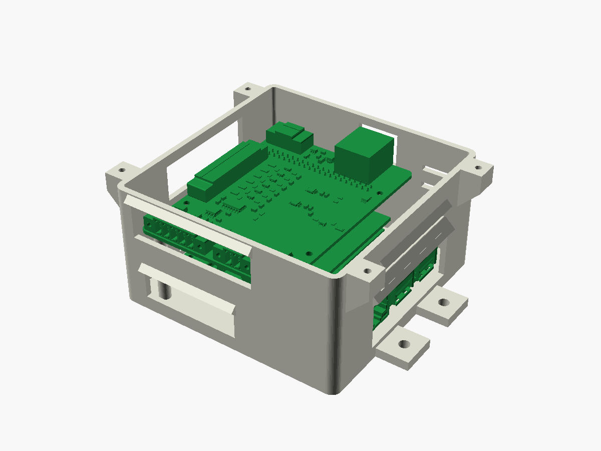
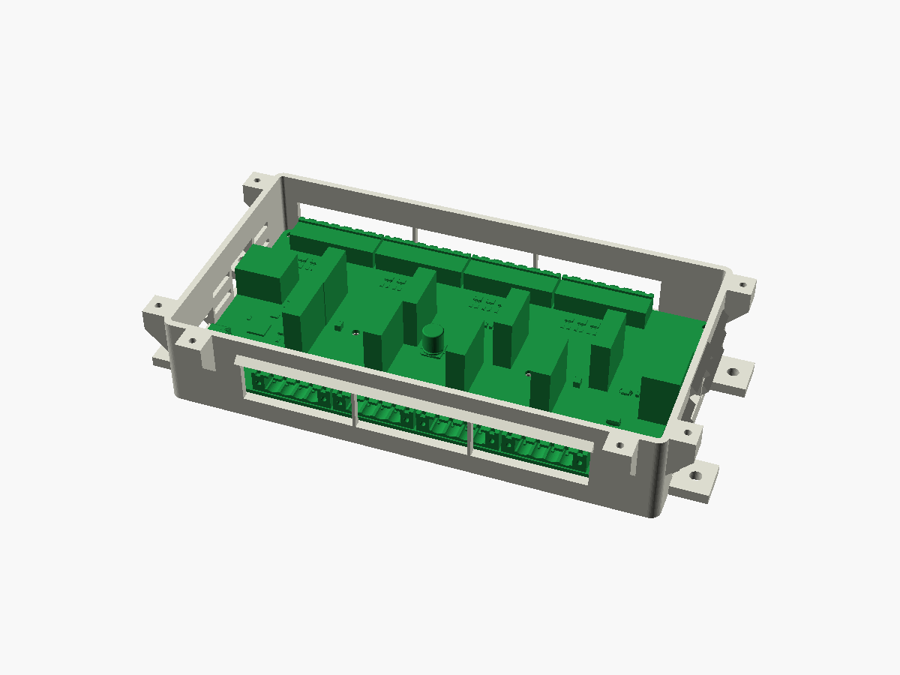
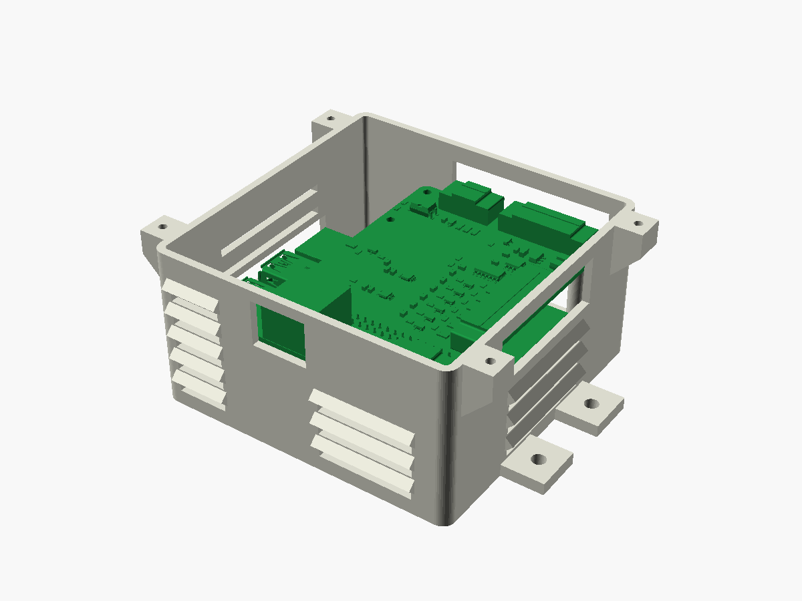
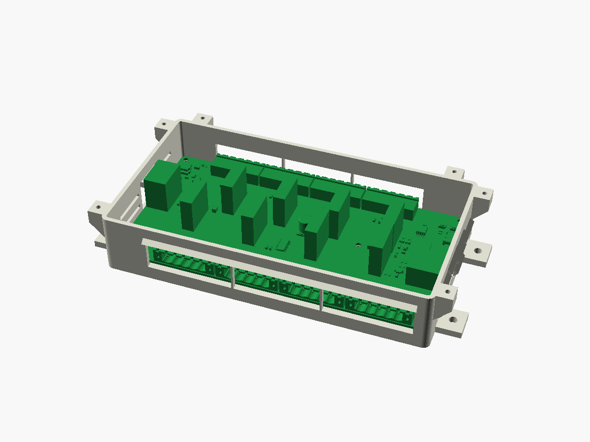

# Enclosures: the Pi box and the LED box

Two boxes to 3D-print in PETG. Each is a base and a screw-on lid:

- **Pi box.** Holds the Raspberry Pi 5, the M.2 SSD board over its Active Cooler, and the
  sensor board on top. It measures 100 × 100 × 55 mm, not counting the ears and lugs.
- **LED box.** Holds the LED board. It measures 185 × 101 × 38 mm.

| Pi box | LED box |
| --- | --- |
|  |  |
|  |  |

## Built for humidity, not spray

Both boxes go behind the dash. A sealed box would trap damp air, and it would condense on the
boards whenever the temperature drops. So the boxes breathe, but water can't drip in:

- The lid has no openings, and it overhangs the walls by 1.5 mm. Drips fall clear of the
  seam.
- The vents are louvres: slots in the side walls, each under a hood that slopes down and out.
  Every connector window has a hood like that above it too.
- Each floor corner has a 3 mm drain hole.
- **Conformal-coat both boards** (MG Chemicals 422B silicone or similar). The coating, not
  the box, is what keeps condensation off the parts. Mask these before you spray:
  - every connector
  - the fuse clips
  - the RJ45 and USB jacks
  - the GPIO header pins
  - the push buttons

Mount the boxes floor-down, with the walls vertical, so the hoods and the drains work.

## Files (`out/`)

| File | What it's for |
| --- | --- |
| `*-base.3mf`, `*-lid.3mf` | Bambu Studio. Already oriented to print: the bases stand on their floors, and the lids are upside down. |
| `*.stl` | The same parts as STL, for any other slicer. |
| `*-base.step`, `*-lid.step` | Fusion 360 (File → Open). Each part sits where it goes in the box, and you can edit it. |
| `*-assembly.step` | Each box with its boards in place, to check the fit in Fusion. These aren't in git because they're large. `enclosures.py` writes them. |

## Printing (Bambu, 256 mm bed, PETG)

- Layer height 0.2 mm, 5 walls (the 2.5 mm walls come out solid), 20–25 % infill.
- **No supports.**
  - The hoods, lugs and the undersides of the lugs are 45° slopes.
  - The window tops are short bridges.
  - The LED box's two long plug windows have thin ribs across them, so their tops print as
    short bridges. **Snip the ribs out with flush cutters after printing.**
- Print the bases floor-down and the lids top-down, as the 3MF files already have them.

## Hardware

**Pi box**

| Qty | Part | For |
| --- | --- | --- |
| 4 | M2.5 × 10 pan-head screw | Up through the floor posts and the Pi, into the M.2 kit's brass standoffs. They replace the kit's four lower screws. |
| 1 | M2.5 × 8 screw | Down through the sensor board's fifth hole, into the tall post under its overhang. It cuts its own thread in PETG. |
| 4 | M3 × 10 self-tapping screw | The lid into the lugs. |
| 4 | #8 or M4 screw | The ears to the boat. |

**LED box**

| Qty | Part | For |
| --- | --- | --- |
| 6 | M3 × 8 self-tapping screw | The board onto the posts. **Use nylon for the two in the middle:** they sit in the 12 V bus. |
| 6 | M3 × 10 self-tapping screw | The lid into the lugs. |
| 4 | #8 or M4 screw | The ears to the boat. |

If you'll open a lid often (the LED box, to change fuses), use M3 heat-set inserts in the lugs
instead of self-tapping screws. Set `LUG_PILOT = 4.0` in `enclosures.py` and run it again.

## Before printing the Pi box: measure the stack

Two heights aren't published anywhere: how high the M.2 board and the sensor board sit above
the Pi. `enclosures.py` estimates them:

```python
SSD_HAT_Z = 13.8   # the M.2 board's underside, above the Pi's underside
SENSOR_Z = 26.0    # the sensor board's underside, above the Pi's underside
```

Assemble the stack (Pi, Active Cooler, M.2 board on its standoffs and stacking header, and the
sensor board). Measure both heights with calipers, from the underside of the Pi's board. Put
them in `enclosures.py` and run it again, and the windows and posts follow. The box can only
be checked against the heights it's given.

The LED box has one estimate too:
- `FUSE_TOP = 22.0` is the top of an ATO fuse sitting in its holder, measured from the LED
  board's underside. The holder itself is 17.5 mm tall, per Littelfuse.
- The rim sits 4.5 mm above that height.

## Regenerating

With FreeCAD 1.0 installed, run this from this directory:

```bash
"$LOCALAPPDATA/Programs/FreeCAD 1.0/bin/freecadcmd.exe" enclosures.py
```

It does five things:
1. Exports both boards from KiCad (`kicad-cli`).
2. Builds the boxes.
3. Checks every part of every board against the walls, posts and lid.
4. Prints any clash it finds.
5. Writes `out/`.

For the Pi itself to be included in that check, put Raspberry Pi's model in `models/`:
1. Download `RaspberryPi5-step.zip` from datasheets.raspberrypi.com (MIT licence).
2. Extract `rpi-5b_no_graphics.step` into `models/`.

That model has no micro-HDMI sockets, so the Pi box has one wide opening for USB-C and both
HDMI ports. The plugs' overmoulds need that room anyway.

## What goes where

**Pi box**

| Wall | Openings |
| --- | --- |
| USB-C/HDMI side | USB-C and both micro-HDMI, reached 20 mm in under the sensor board. Above them, J5 (NMEA 2000) and J2 (tach). |
| USB side | The Pi's two USB stacks and Ethernet. |
| Power-button end | J1 (the gauge taps). It sits 6 mm in from the wall, because the M.2 board's ribbon cable loops out beside the Pi there. |
| GPIO side | J6, the RJ45 to the LED board. |

The sensor board's own J7 5 V input has no window: on the boat the Pi 5 runs from its USB-C.
Drill one if that changes.

**LED box**

| Wall | Openings |
| --- | --- |
| Zone-output side | The four zone outputs (J3–J6). |
| Pixel-output side | The four addressable outputs (J7–J10). |
| 12 V end | The 12 V input (J2), for 10 AWG. |
| RJ45 end | The RJ45 link (J1), and the USB-C for loading firmware. |

BOOTSEL, RESET and the fuses are reached with the lid off.
